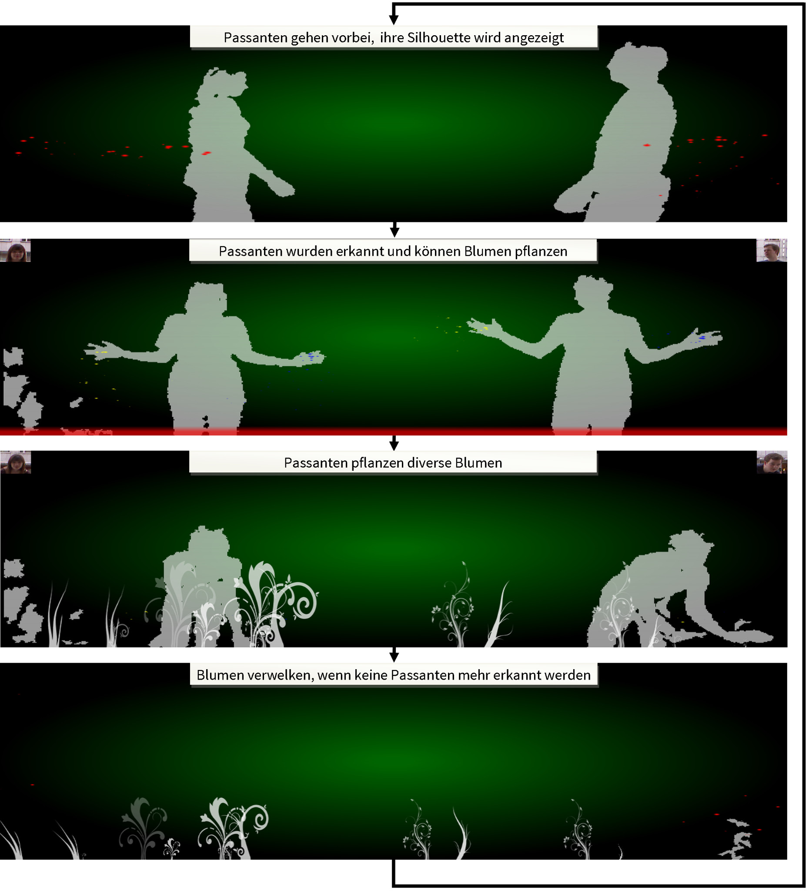
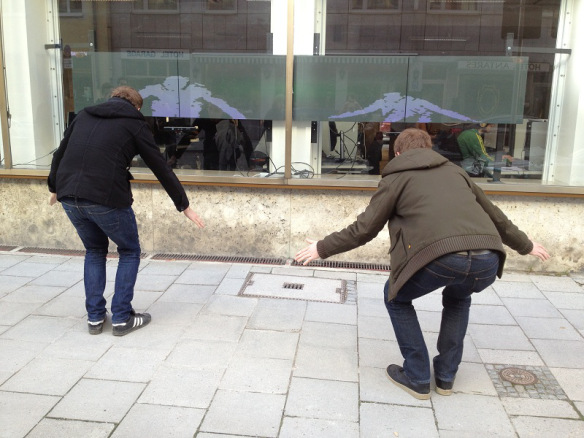

starFlowers
===========
Star Flowers is an interactive art simulation by Frederik Brudy and Janko Hofmann: A passing stranger can interact with an initially blank screen. He can seed plants and watch them grow. As long as he is present, his plants will flourish, but as soon as he leaves they will wither and the simulation starts over again. 

A video, demonstrating the application can be found on Vimeo: https://vimeo.com/64384008 . 

More information about the Making-Of this app can be found on http://programmingwithkinect.wordpress.com

The states of the simulation can be seen in the following diagram:

As in real life: Gardening ist hard work, as you can see in the following picture:

Our app works well with two separate Kinects and manages to display at a high framerate, which we fixed at 33FPS. To prevent burning in on the screens, there is not static content, thus making the app suitable for long-time-display.

The used particle system is derived from the on Microsoft presents in its <a href="http://msdn.microsoft.com/en-us/library/vstudio/ms771772(v=vs.90).aspx">Particle Effect for WPF Application Samples</a>.